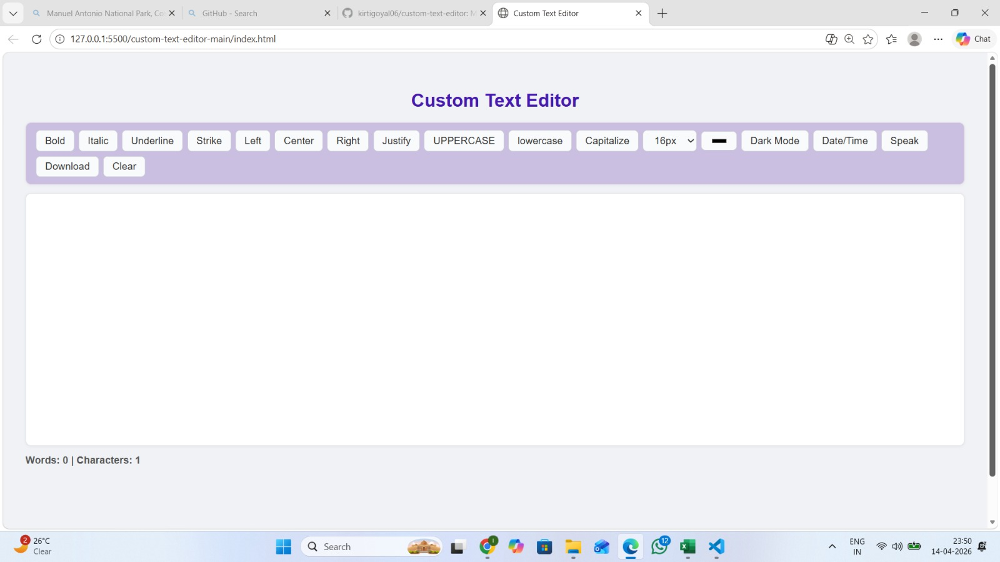

# Custom Text Editor

A simple text editor made using HTML, CSS and JavaScript.

## Features
- Bold, Italic, Underline, Strike
- Text Alignment
- Uppercase, Lowercase, Capitalize
- Font Size and Text Color
- Dark Mode
- Date and Time Insert
- Word and Character Count
- Text to Speech
- Download as `.txt`
- Auto Save using localStorage

## Preview



## Project Files

```text
index.html      → Structure
style.css       → Styling
script.js       → Functionality
screenshot.jpeg → Project Screenshot
```

## **How to Run**


Download or clone this repository


Keep all files in the same folder:


index.html


style.css


script.js


screenshot.jpeg.jpeg


Open index.html in any browser


The editor will start automatically.

## How It Works


contenteditable makes the editor writable


JavaScript handles formatting and counting


Dark mode works using a CSS class


Text is saved automatically with localStorage


## Live Demo

[Open Project](https://kirtigoyal06.github.io/custom-text-editor/)

